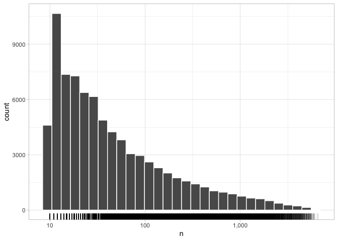
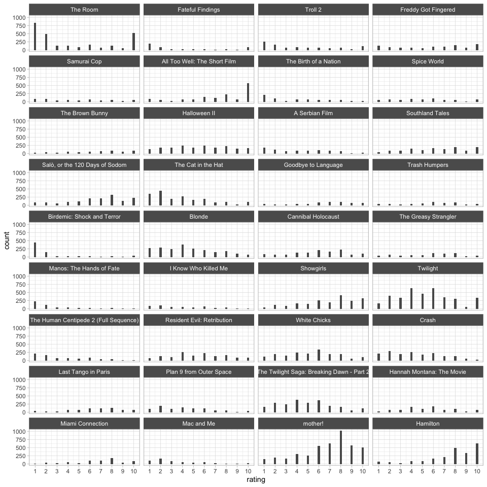

<!-- README.md is generated from README.Rmd. Please edit that file -->

# movies-dataset

<!-- badges: start -->
<!-- badges: end -->

The `movies-dataset` repository contains data scraped from
<https://letterboxd.com/>

`download/00-get-users.R` creates the `users.rds` file, which contains
user-level information on the 7,500 most popular users of all time.

``` r
library(tidyverse)
users <- readRDS("download/users.rds")
glimpse(users)
#> Rows: 7,500
#> Columns: 6
#> $ name    <chr> "karsten", "Lucy", "davidehrlich", "Jay", "SilentDawn", "matt …
#> $ reviews <dbl> 1271, 1729, 2257, 1367, 2561, 5336, 1167, 2974, 624, 561, 2076…
#> $ watched <dbl> 1671, 2487, 2579, 1144, 4758, 5367, 2573, 4659, 800, 2479, 402…
#> $ lists   <dbl> 53, 128, 53, 89, 126, 26, 173, 31, 17, 17, 26, 90, 14, 168, 18…
#> $ likes   <dbl> 2365, 7557, 81, 21762, 21930, 7338, 11042, 6694, 1009, 7130, 3…
#> $ href    <chr> "/kurstboy/", "/deathproof/", "/davidehrlich/", "/jay/", "/sil…
```

The information contain in the `href` variable was then used to scrape
ratings-per user with the `download/01-get-ratings-from-users.R` script.
This data is stored in the `user_ratings.rds` file.

``` r
user_ratings <- readRDS("download/user_ratings.rds")
glimpse(user_ratings)
#> Rows: 13,393,518
#> Columns: 4
#> $ href           <fct> /__lobster__/, /__lobster__/, /__lobster__/, /__lobster…
#> $ data_film_slug <fct> /film/blonde-2022/, /film/pearl-2022/, /film/tar-2022/,…
#> $ data_film_id   <int> 228594, 853822, 734096, 622654, 682547, 886145, 658830,…
#> $ rating         <int> 4, 4, 4, 5, 4, 5, 5, 7, 8, 3, 4, 7, 7, 7, 4, 5, 6, 8, 4…
```

**Number of movies:**

*Note, movies with two raters or less were removed.*

``` r
length(unique(user_ratings$data_film_slug))
#> [1] 162501
```

**Number of users:**

``` r
length(unique(user_ratings$href))
#> [1] 7326
```

*Note. This should be roughly equal to 7500. As of November 29 2022, the
number of users with data represents 97.68% of the total users in our
sample. The missing users are probably due to the fact that: (1) they
deleted their accounts between sampling and collection, (2) they’re
active users but don’t actually rate movies, or (3) they have only rated
movies that are too niche (i.e., no other two users in the sample rated
the same movie).*

**Count of movies rated by users (example):**

``` r
theme_set(theme_light())

user_ratings |> 
  count(data_film_slug) |> 
  ggplot(aes(n)) + 
  geom_histogram(color = "white") + 
  geom_rug(alpha = 1/10) + 
  scale_x_log10(labels = scales::comma) 
```

<!-- -->

**Count of ratings by users (example):**

``` r
user_ratings |> 
  count(href) |> 
  ggplot(aes(n)) + 
  geom_histogram(color = "white") + 
  geom_rug(alpha = 1/10) + 
  scale_x_log10(labels = scales::comma) 
#> `stat_bin()` using `bins = 30`. Pick better value with `binwidth`.
```

<!-- -->

**A sample of movie ratings (example):**

``` r
metadata <- read_rds("download/metadata.rds")

user_ratings |> 
  nest(data = !data_film_slug) |> 
  mutate(n = map_dbl(data, nrow)) |> 
  slice_max(n = 36, order_by = n) |> 
  unnest(cols = "data") |> 
  left_join(select(metadata, data_film_slug, alt), by = "data_film_slug") |> 
  mutate(alt = fct_reorder(alt, -n)) |>
  ggplot(aes(rating)) + 
  geom_bar(width = 1/5) + 
  facet_wrap(~alt, ncol = 4) +
  scale_x_continuous(breaks = 1:10, labels = 1:10)
```

<!-- -->

**Polarizing movies (example):**

``` r
polarizing <- user_ratings |> 
  group_by(data_film_slug) |> 
  filter(n() >= 500) |>
  summarize(var = var(rating)) |> 
  slice_max(n = 36, order_by = var)

user_ratings |> 
  filter(data_film_slug %in% polarizing$data_film_slug) |> 
  left_join(select(metadata, data_film_slug, alt), by = "data_film_slug") |> 
  mutate(alt = fct_reorder(alt, .x = rating, .fun = var, .desc = TRUE)) |>
  ggplot(aes(rating)) + 
  geom_bar(width = 1/5) + 
  facet_wrap(~alt, ncol = 4) +
  scale_x_continuous(breaks = 1:10, labels = 1:10)
```

<!-- -->

**How does the rating of movies of our sample of users compare to the
overall ratings?**

*Note. I’m only comparing movies with 10 raters or more.*

``` r
user_ratings |> 
  inner_join(metadata)  |> 
  group_by(data_film_slug, alt) |> 
  filter(n() >= 10) |> 
  summarize(
    all_avg = unique(data_average_rating*2), ## make ratings compatible
    sample_avg = mean(rating), 
    sample_size = n()
  ) |> 
  ggplot(aes(all_avg, sample_avg)) + 
  geom_point(aes(color = log(sample_size)), alpha = 1/5) + 
  geom_smooth(method = "lm") + 
  geom_abline(slope = 1, intercept = 0, color = "red", linetype = "dashed") + 
  ylim(1, 10) + xlim(1, 10) + 
  theme(legend.position = "bottom") +
  scale_color_viridis_c() +
  scale_x_continuous(breaks = 1:10, labels = 1:10) +
  scale_y_continuous(breaks = 1:10, labels = 1:10)
```

<!-- -->

Every movie under the red line of equality was rated higher by the full
population of users; every movie over the line of equality was rated
higher by the sample of popular users. Looks good!

------------------------------------------------------------------------

*We should also add other types of metadata per movie, like date and
genre. We can also extract network data (i.e., who among the users
follows who), but I wouldn’t know how to use that…*

*Note, there’s currently an API in beta. We should consider applying for
this so that the data becomes “legal.”*

-   <https://letterboxd.com/api-beta/>
-   <https://api-docs.letterboxd.com/>
