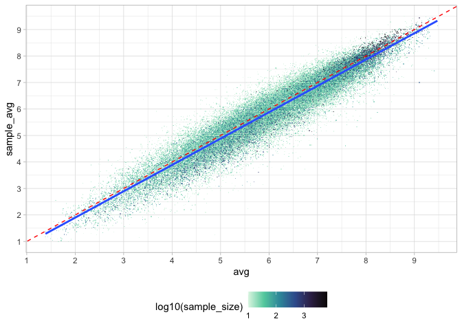

<!-- README.md is generated from README.Rmd. Please edit that file -->

# movies-dataset

<!-- badges: start -->
<!-- badges: end -->

``` r
library(tidyverse)
```

The `movies-dataset` repository contains data scraped from
<https://letterboxd.com/>

`download/00-get-users.R` creates the `users.rds` file, which contains
user-level information on the 7,500 most popular users of all time.

``` r
users <- read_rds("download/users.rds")
glimpse(users)
#> Rows: 7,500
#> Columns: 6
#> $ name    <chr> "karsten", "Lucy", "davidehrlich", "Jay", "SilentDawn", "matt …
#> $ reviews <int> 1271, 1729, 2257, 1367, 2561, 5336, 1167, 2974, 624, 561, 2076…
#> $ watched <int> 1671, 2487, 2579, 1144, 4758, 5367, 2573, 4659, 800, 2479, 402…
#> $ lists   <dbl> 53, 128, 53, 89, 126, 26, 173, 31, 17, 17, 26, 90, 14, 168, 18…
#> $ likes   <int> 2365, 7557, 81, 21762, 21930, 7338, 11042, 6694, 1009, 7130, 3…
#> $ href    <chr> "/kurstboy/", "/deathproof/", "/davidehrlich/", "/jay/", "/sil…
```

The information contain in the `href` variable was then used to scrape
ratings-per user with the `download/01-get-ratings-from-users.R` script.
This data is stored in the `user_ratings.rds` file.

``` r
user_ratings <- read_rds("download/user_ratings.rds")
glimpse(user_ratings)
#> Rows: 4,399,616
#> Columns: 5
#> $ href           <chr> "/_jhags/", "/_jhags/", "/_jhags/", "/_jhags/", "/_jhag…
#> $ data_film_slug <chr> "/film/halloween-ends/", "/film/dont-worry-darling/", "…
#> $ data_film_id   <chr> "543596", "546347", "853822", "682547", "861294", "7363…
#> $ stars          <chr> "★★★★½", "★★★", "★★★★", "★★★★★", "★★★", "★★★", "★★★★", …
#> $ rating         <dbl> 4.5, 3.0, 4.0, 5.0, 3.0, 3.0, 4.0, 4.0, 4.0, 5.0, 4.0, …
```

Number of movies:

``` r
length(unique(user_ratings$data_film_slug))
#> [1] 203623
```

Number of users:

``` r
length(unique(user_ratings$href))
#> [1] 1909
```

*Note. When I’m finished scraping, this should be roughly equal to 7500.
As of November 23 (2022), the number of users with data represents
25.45% of the total users we have sampled.*

Count of movies rated by users (example):

``` r
user_ratings |> 
  count(data_film_slug) |> 
  ggplot(aes(n)) + 
  geom_histogram(color = "white") + 
  geom_rug(alpha = 1/10) + 
  scale_x_log10() 
#> `stat_bin()` using `bins = 30`. Pick better value with `binwidth`.
```

<!-- -->

A sample of movie ratings (example):

``` r
metadata <- read_rds("download/metadata.rds")

user_ratings |> 
  filter(!is.na(rating)) |> 
  nest(data = !data_film_slug) |> 
  mutate(n = map_dbl(data, nrow)) |> 
  slice_max(n = 24, order_by = n) |> 
  unnest(cols = "data") |> 
  left_join(select(metadata, data_film_slug, alt), by = "data_film_slug") |> 
  mutate(alt = fct_reorder(alt, -n)) |>
  ggplot(aes(rating)) + 
  geom_bar(width = 1/5) + 
  facet_wrap(~alt, ncol = 3)
```

<!-- -->

**How does the rating of movies of our sample of users compare to the
overall ratings?**

``` r
inner_join(metadata, user_ratings) |> 
  filter(!is.na(rating)) |> 
  group_by(data_film_slug, alt) |> 
  summarize(all_avg = mean(data_average_rating), sample_avg = mean(rating), sample_size = n()) |> 
  ggplot(aes(all_avg, sample_avg)) + 
  geom_jitter(aes(color = log(sample_size)), alpha = 1/10) + 
  geom_smooth(method = "lm") + 
  geom_abline(slope = 1, intercept = 0, color = "red", linetype = "dashed") + 
  ylim(0.5, 5) + xlim(0.5, 5) + 
  theme(legend.position = "bottom") + 
  scale_color_viridis_c()
#> Joining, by = c("data_film_slug", "data_film_id")
#> `summarise()` has grouped output by 'data_film_slug'. You can override using
#> the `.groups` argument.
#> `geom_smooth()` using formula = 'y ~ x'
```

<!-- -->

This graph makes it look like our more popular users are different from
*all* users. Every movie under the red line of equality was rated higher
by the full population of users; every movie over the line of equality
was rated higher by the sample of popular users. But, as the colors
show, this is simply an issue of sample size; all high-sample movies
cluster near the line of equality. This means we might not have “biased”
samples after all.

------------------------------------------------------------------------

*We should also add other types of metadata per movie, like date and
genre. We can also extract network data (i.e., who among the users
follows who), but I wouldn’t know how to use that…*

*Note, there’s currently an API in beta. We should consider applying for
this so that the data becomes “legal.”*

-   <https://letterboxd.com/api-beta/>
-   <https://api-docs.letterboxd.com/>
