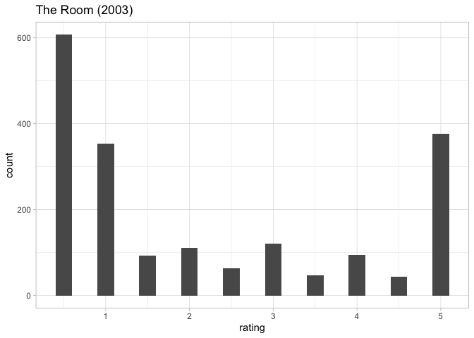

<!-- README.md is generated from README.Rmd. Please edit that file -->

# movies-dataset

<!-- badges: start -->
<!-- badges: end -->

``` r
library(tidyverse)
```

The `movies-dataset` repository contains data scraped from
<https://letterboxd.com/>

`download/00-get-users.R` creates the `users.rds` file, which contains
user-level information on the 7,500 most popular users of all time.

``` r
users <- read_rds("download/users.rds")
glimpse(users)
#> Rows: 7,500
#> Columns: 6
#> $ name    <chr> "karsten", "Lucy", "davidehrlich", "Jay", "SilentDawn", "matt …
#> $ reviews <int> 1271, 1729, 2257, 1367, 2561, 5336, 1167, 2974, 624, 561, 2076…
#> $ watched <int> 1671, 2487, 2579, 1144, 4758, 5367, 2573, 4659, 800, 2479, 402…
#> $ lists   <dbl> 53, 128, 53, 89, 126, 26, 173, 31, 17, 17, 26, 90, 14, 168, 18…
#> $ likes   <int> 2365, 7557, 81, 21762, 21930, 7338, 11042, 6694, 1009, 7130, 3…
#> $ href    <chr> "/kurstboy/", "/deathproof/", "/davidehrlich/", "/jay/", "/sil…
```

The information contain in the `href` variable was then used to scrape
ratings-per user with the `download/01-get-ratings-from-users.R` script.
This data is stored in the `user_ratings.rds` file.

``` r
user_ratings <- read_rds("download/user_ratings.rds")
glimpse(user_ratings)
#> Rows: 1,932,364
#> Columns: 5
#> $ href           <chr> "/50sromance/", "/50sromance/", "/50sromance/", "/50sro…
#> $ data_film_slug <chr> "/film/halloween-ends/", "/film/hellraiser-2022/", "/fi…
#> $ data_film_id   <chr> "543596", "268360", "683194", "228594", "546347", "8538…
#> $ stars          <chr> "★★★★", "★★★½", "★★★★", "½", "★★", "★★★★★", "★★★★", "★★…
#> $ rating         <dbl> 4.0, 3.5, 4.0, 0.5, 2.0, 5.0, 4.0, 4.0, 3.0, 3.5, 0.5, …
```

Number of movies in the subset:

``` r
length(unique(user_ratings$data_film_slug))
#> [1] 150647
```

Number of users in the subset:

``` r
length(unique(user_ratings$href))
#> [1] 818
```

*Note. When I’m finished scraping, this should be roughly equal to 7500.
As of 2022-11-21, the number of users with data represents 10.907% of
the total users.*

Example:

``` r
metadata <- read_rds("download/metadata.rds")

user_ratings |> 
  nest(data = !data_film_slug) |> 
  mutate(n = map_dbl(data, nrow)) |> 
  slice_head(n = 15) |> 
  unnest(cols = "data") |> 
  left_join(select(metadata, data_film_slug, alt), by = "data_film_slug") |> 
  ggplot(aes(rating)) + 
  geom_bar(width = 1/5) + 
  facet_wrap(~alt, ncol = 3)
```

<!-- -->

------------------------------------------------------------------------

*We should also add other types of metadata per movie, like date and
genre.*

*Note, there’s currently an API in beta. We should consider applying for
this so that the data becomes “legal.”*

-   <https://letterboxd.com/api-beta/>
-   <https://api-docs.letterboxd.com/>
