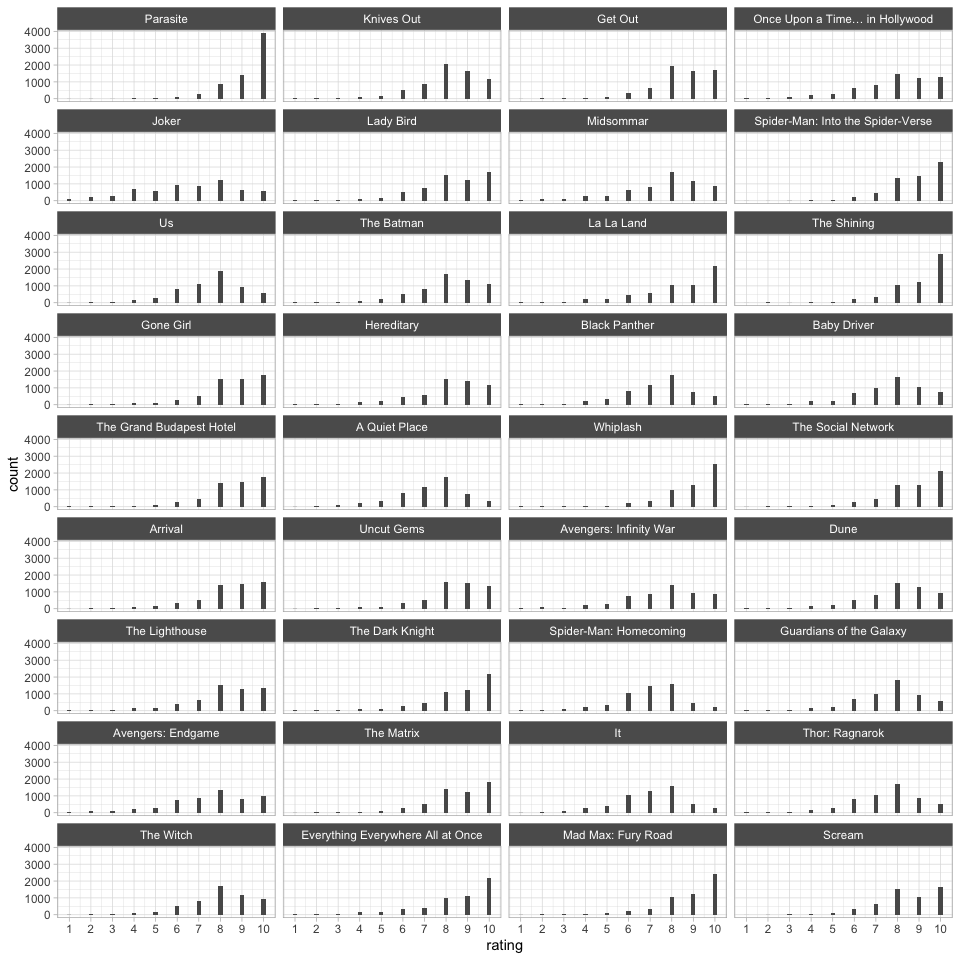

<!-- README.md is generated from README.Rmd. Please edit that file -->

# movies-dataset

<!-- badges: start -->
<!-- badges: end -->

The `movies-dataset` repository contains data scraped from
<https://letterboxd.com/>

`download/00-get-users.R` creates the `users.rds` file, which contains
user-level information on the 7,500 most popular users of all time. The
`download/01-update-add-more-users.R` script adds more users to this
file.

``` r
library(tidyverse)
users <- readRDS("download/users.rds")
glimpse(users)
#> Rows: 7,976
#> Columns: 6
#> $ name    <chr> "Brendan Michaels", "Adam", "Sergio Muñoz Esquer", "JC13", "Ni…
#> $ reviews <dbl> 1820, 187, 505, 5455, 1106, 572, 2756, 171, 3525, 1220, 1200, …
#> $ watched <dbl> 4957, 606, 1699, 4442, 2681, 4470, 5071, 2088, 4353, 3328, 367…
#> $ lists   <dbl> 164, 1, 29, 374, 52, 340, 29, 8, 55, 107, 199, 159, 8, 7, 40, …
#> $ likes   <dbl> 28795, 4381, 374, 9475, 1976, 5137, 3360, 2725, 1421, 5627, 53…
#> $ href    <chr> "/jackflowers/", "/witchingay/", "/semunozesqu/", "/jc13/", "/…
```

The information contain in the `href` variable was then used to scrape
ratings-per user with the `download/02-get-ratings-from-users.R` script.
This data is stored in the `user_ratings.rds` file.

``` r
user_ratings <- readRDS("download/user_ratings.rds")
glimpse(user_ratings)
#> Rows: 13,541,224
#> Columns: 4
#> $ href           <fct> /__lobster__/, /__lobster__/, /__lobster__/, /__lobster…
#> $ data_film_slug <fct> /film/blonde-2022/, /film/pearl-2022/, /film/tar-2022/,…
#> $ data_film_id   <int> 228594, 853822, 734096, 622654, 682547, 886145, 658830,…
#> $ rating         <int> 4, 4, 4, 5, 4, 5, 5, 7, 8, 3, 4, 7, 7, 7, 4, 5, 6, 8, 4…
```

`3-get-additional-movie-info.R` creates a variety of datasets.

- The `metadata.rds` file contains additional information.

``` r
metadata <- read_rds("download/metadata.rds")
glimpse(metadata)
#> Rows: 80,295
#> Columns: 5
#> $ title          <chr> "London After Midnight", "Pass the Gravy", "Three Darin…
#> $ data_film_slug <chr> "/film/london-after-midnight/", "/film/pass-the-gravy/"…
#> $ year           <int> 1927, 1928, 1948, 1969, 1925, 1977, 1988, 1901, 1984, 1…
#> $ duration       <int> 69, 23, 115, 10, 8, 28, 90, 4, 80, 1, 3, 2, 8, 101, 94,…
#> $ data_film_id   <int> 10, 100002, 100003, 100004, 100011, 100012, 100015, 100…
```

The `crew.rds` file

``` r
crew <- read_rds("download/crew.rds")
glimpse(crew)
#> Rows: 824,640
#> Columns: 4
#> $ data_film_slug <fct> /film/london-after-midnight/, /film/london-after-midnig…
#> $ person_href    <chr> "/director/tod-browning/", "/producer/tod-browning/", "…
#> $ role           <fct> director, producer, producer, writer, writer, editor, e…
#> $ person         <chr> "tod-browning", "tod-browning", "irving-thalberg", "tod…
```

The `cast.rds` file.

``` r
cast <- read_rds("download/cast.rds")
glimpse(cast)
#> Rows: 1,251,247
#> Columns: 4
#> $ role           <chr> "Professor Edward C. Burke", "Lucille Balfour", "Sir Ja…
#> $ actor_href     <fct> /actor/lon-chaney/, /actor/marceline-day/, /actor/henry…
#> $ actor          <chr> "Lon Chaney", "Marceline Day", "Henry B. Walthall", "Pe…
#> $ data_film_slug <fct> /film/london-after-midnight/, /film/london-after-midnig…
```

The `genre.rds` file.

``` r
genre <- read_rds("download/genre.rds")
glimpse(genre)
#> Rows: 156,708
#> Columns: 3
#> $ data_film_slug <chr> "/film/london-after-midnight/", "/film/london-after-mid…
#> $ genre_href     <chr> "/films/genre/drama/", "/films/genre/horror/", "/films/…
#> $ genre          <chr> "drama", "horror", "comedy", "romance", "music", "comed…
```

The `details.rds` file. This file is slightly more complex because it’s
stored as a nested data frame—i.e., some movies are made by multiple
studios, contain multiple spoken languages, etc.

``` r
details <- read_rds("download/details.rds")

glimpse(details)
#> Rows: 80,235
#> Columns: 5
#> $ data_film_slug    <chr> "/film/london-after-midnight/", "/film/pass-the-grav…
#> $ Studio            <named list> "/studio/metro-goldwyn-mayer-1/", "/studio/ha…
#> $ Country           <named list> "/films/country/usa/", "/films/country/usa/",…
#> $ Language          <named list> "/films/language/english/", "/films/language/…
#> $ `Spoken Language` <named list> "/films/language/no-spoken-language/", <NULL>…
```

The `05-get-movie-histograms.R` scrapes the ratings associated with the
full population of users. This creates the `movie_ratings.rds` file.

``` r
movie_ratings <- read_rds("download/movie_ratings.rds")
glimpse(movie_ratings)
#> Rows: 802,210
#> Columns: 4
#> $ rating         <int> 1, 2, 3, 4, 5, 6, 7, 8, 9, 10, 1, 2, 3, 4, 5, 6, 7, 8, …
#> $ n              <int> 7, 5, 5, 31, 57, 170, 82, 68, 6, 39, 0, 2, 3, 8, 15, 44…
#> $ data_film_slug <fct> /film/london-after-midnight/, /film/london-after-midnig…
#> $ data_film_id   <int> 10, 10, 10, 10, 10, 10, 10, 10, 10, 10, 100002, 100002,…
```

Finally, the `06-get-user-following.R` gets the social networks among
the users in the sample. This file is weird because the “following”
behavior across users varies a lot (although it’s not unlike a Twitter
network)! In short, the `user_following.rds` files is an edgelist that
can be paired with the `users.rds` data on each node.

``` r
following <- read_rds("download/user_following.rds")
glimpse(following)
#> Rows: 984,864
#> Columns: 2
#> $ from <fct> /__lobster__/, /__lobster__/, /__lobster__/, /__lobster__/, /__lo…
#> $ to   <fct> /thomasflight/, /fares1992/, /firstshowing/, /zshevich/, /kurstbo…
```

## Descriptive Statistics

**Number of movies:**

*Note, movies with less than 10 movies were removed.*

``` r
length(unique(user_ratings$data_film_slug))
#> [1] 80305
```

**Number of users:**

*Note, user with less than 10 movies were removed.*

``` r
length(unique(user_ratings$href))
#> [1] 7794
```

*Note. As of December 25 2022, the number of users with data represents
97.72% of the total users in our sample. The missing users are probably
due to the fact that: (1) they deleted their accounts between sampling
and collection, (2) they’re active users but don’t actually rate movies,
or (3) they have only rated movies that are too niche (i.e., no other
ten users in the sample rated the same movie).*

**Count of movies rated by users (example):**

``` r
theme_set(theme_light() + theme(strip.background = element_rect(fill = "#5C5C5C")))

user_ratings |> 
  count(data_film_slug) |> 
  ggplot(aes(n)) + 
  geom_histogram(color = "white") + 
  geom_rug(alpha = 1/10) + 
  scale_x_log10(labels = scales::comma) 
```

<!-- -->

**Count of ratings by users (example):**

``` r
user_ratings |> 
  count(href) |> 
  ggplot(aes(n)) + 
  geom_histogram(color = "white") + 
  geom_rug(alpha = 1/10) + 
  scale_x_log10(labels = scales::comma) 
#> `stat_bin()` using `bins = 30`. Pick better value with `binwidth`.
```

<!-- -->

**A sample of movie ratings (example):**

``` r
user_ratings |> 
  nest(data = !data_film_slug) |> 
  mutate(n = map_dbl(data, nrow)) |> 
  slice_max(n = 36, order_by = n) |> 
  unnest(cols = "data") |> 
  left_join(select(metadata, data_film_slug, title), by = "data_film_slug") |> 
  mutate(title = fct_reorder(title, -n)) |>
  ggplot(aes(rating)) + 
  geom_bar(width = 1/5) + 
  facet_wrap(~title, ncol = 4) +
  scale_x_continuous(breaks = 1:10, labels = 1:10)
```

<!-- --> **Polarizing
movies (example):**

``` r
polarizing <- user_ratings |> 
  group_by(data_film_slug) |> 
  filter(n() >= 500) |>
  summarize(var = var(rating)) |> 
  slice_max(n = 36, order_by = var)

user_ratings |> 
  filter(data_film_slug %in% polarizing$data_film_slug) |> 
  left_join(select(metadata, data_film_slug, title), by = "data_film_slug") |> 
  mutate(title = fct_reorder(title, .x = rating, .fun = var, .desc = TRUE)) |>
  ggplot(aes(rating)) + 
  geom_bar(width = 1/5) + 
  facet_wrap(~title, ncol = 4) +
  scale_x_continuous(breaks = 1:10, labels = 1:10)
```

<!-- -->

**Duration (in mins)**

``` r
metadata |> 
  filter(!is.na(year)) |> 
  mutate(decade = factor(year - (year %% 10))) |> 
  ggplot(aes(decade, duration)) +
  stat_summary(fun.data = mean_se, fun.args = list(mult = 2), pch = 21, size = 1/4)
#> Warning: Removed 170 rows containing non-finite values (`stat_summary()`).
```

<!-- -->

**Cast**

``` r
cast |> 
  count(actor_href, sort = TRUE)
#> # A tibble: 461,214 × 2
#>    actor_href                   n
#>    <fct>                    <int>
#>  1 /actor/mel-blanc/          738
#>  2 /actor/bess-flowers/       404
#>  3 /actor/frank-welker/       277
#>  4 /actor/pinto-colvig/       201
#>  5 /actor/clarence-nash/      199
#>  6 /actor/christopher-lee/    186
#>  7 /actor/john-carradine/     178
#>  8 /actor/billy-bletcher/     169
#>  9 /actor/danny-trejo/        165
#> 10 /actor/samuel-l-jackson/   164
#> # … with 461,204 more rows
```

**A sample of western movie posters**

``` r
library(magick)
#> Linking to ImageMagick 6.9.12.3
#> Enabled features: cairo, fontconfig, freetype, heic, lcms, pango, raw, rsvg, webp
#> Disabled features: fftw, ghostscript, x11

western <- genre |> 
  filter(genre == "western") |> 
  left_join(metadata)
#> Joining, by = "data_film_slug"

poster_files <- dir("download/movie-pics", full.names = TRUE)
poster_subset <- glue::glue("download/movie-pics/{western$data_film_id}.jpg")
index <- which(str_detect(poster_files, paste(poster_subset, collapse = "|")))

sample(poster_files[index], 5) |> 
  image_read() |> 
  image_scale("x500") |> 
  image_append()
```


``` r

sample(poster_files[index], 5) |> 
  image_read() |> 
  image_scale("x500") |> 
  image_append()
```


``` r

sample(poster_files[index], 5) |> 
  image_read() |> 
  image_scale("x500") |> 
  image_append()
```


**Relationship between “degree” of users and various features**

``` r
full_join(
  users,
  count(following, to, name = "degree"),
  by = c("href" = "to")
) |> 
  filter(!is.na(degree)) |> 
  pivot_longer(reviews:likes, names_to = "variable", values_to = "number") |> 
  ggplot(aes(number, degree)) + 
  geom_point() + 
  geom_smooth() +
  scale_y_log10() + 
  scale_x_log10() + 
  facet_wrap(~variable)
#> Warning: Transformation introduced infinite values in continuous x-axis
#> Transformation introduced infinite values in continuous x-axis
#> `geom_smooth()` using method = 'gam' and formula = 'y ~ s(x, bs = "cs")'
#> Warning: Removed 369 rows containing non-finite values (`stat_smooth()`).
```

<!-- -->

**How does the rating of movies of our sample of users compare to the
overall ratings?**

*Note. I’m only comparing movies with 10 raters or more.*

``` r
inner_join(
  movie_ratings |>  ## full histogram 
    group_by(data_film_slug) |> 
    summarize(avg = weighted.mean(rating, n)),
  user_ratings |> 
    group_by(data_film_slug) |> 
    summarize(sample_avg = mean(rating), sample_size = n())
) |> 
  ggplot(aes(avg, sample_avg)) + 
  geom_point(aes(color = log10(sample_size)), alpha = 1/2, shape = ".") + 
  geom_smooth(method = "lm") + 
  geom_abline(slope = 1, intercept = 0, color = "red", linetype = "dashed") + 
  ylim(1, 10) + xlim(1, 10) + 
  theme(legend.position = "bottom") +
  scale_color_viridis_c(option = "mako", direction = -1) +
  scale_x_continuous(breaks = 1:10, labels = 1:10) +
  scale_y_continuous(breaks = 1:10, labels = 1:10)
```

<!-- -->

Every movie under the red line of equality was rated lower by the sample
of popular users; every movie over the line of equality was rated lower
by the full population of users. Looks good!

------------------------------------------------------------------------

*We should also extract network data (i.e., who among the users follows
who), but I wouldn’t know how to use that…*

*Note, there’s currently an API in beta. We should consider applying for
this so that the data becomes “legal.”*

- <https://letterboxd.com/api-beta/>
- <https://api-docs.letterboxd.com/>
